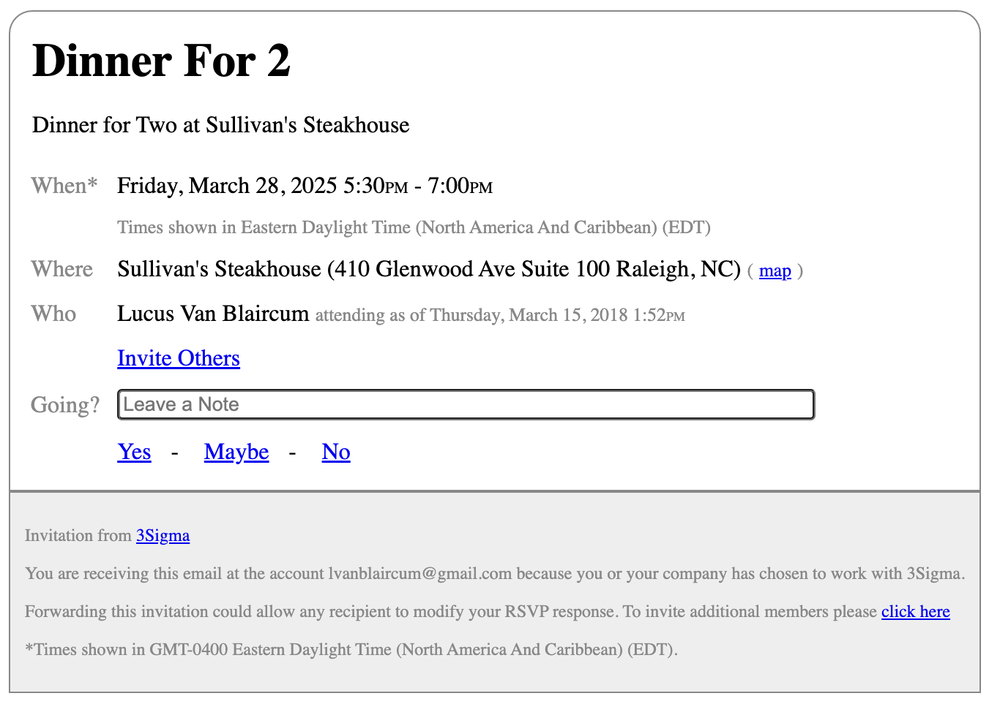
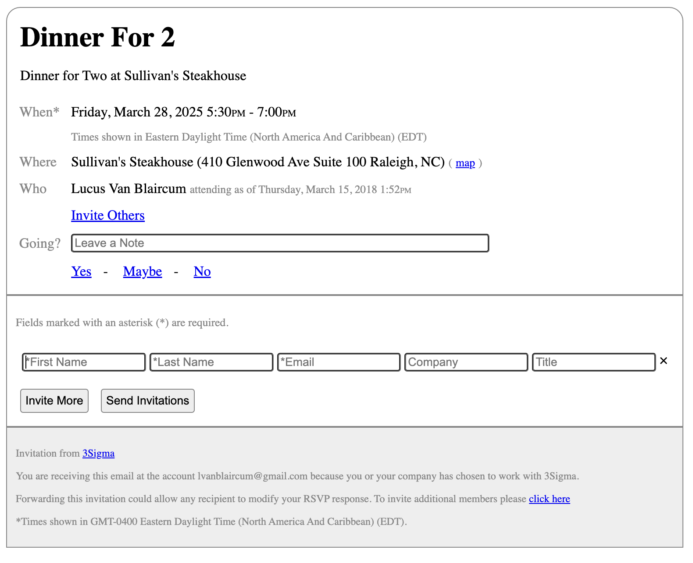
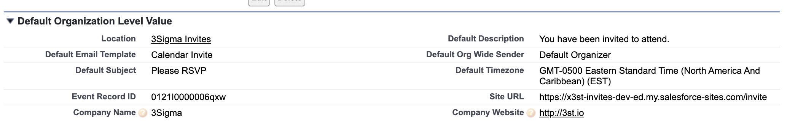
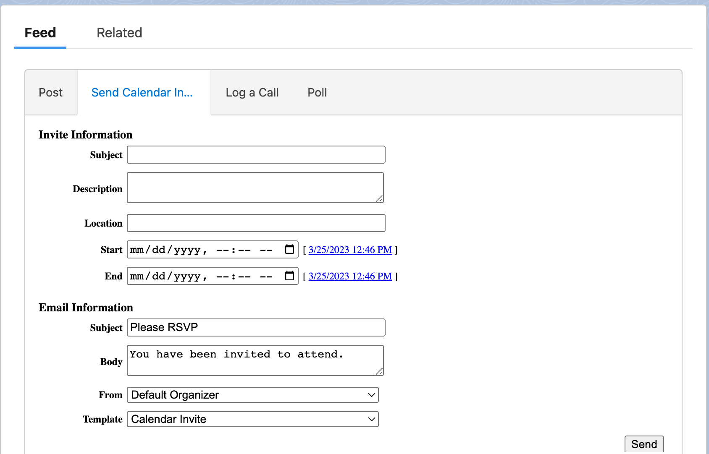
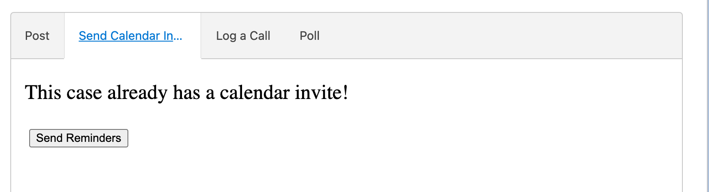
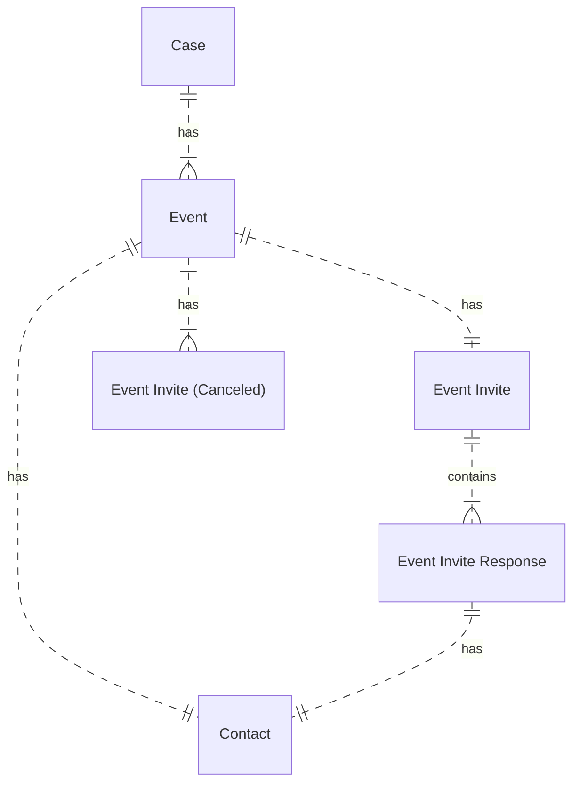

# 3Sigma Invites SFDX Project

This repo holds the code for the 3Sigma Invites managed package.

The latest version of the packaged contents is available in the `/bin/latest.zip` archive.

An example invite can be found [here](https://x3st-invites-dev-ed.my.salesforce-sites.com/invite?eirId=a011I00000CLPXSQA5).

 

# Setup

Following installation you will need to ensure you have a publicly facing site and that the users of that site can read "Event Invite Responses" and that the default Org-wide Email Address is accessible to all profiles (as this email address will be used when invitees invite others). You will further need to ensure the "Calendar Invite" Custom Settings, shown below, are updated.

 

# Sending Invites

 

# Entity Relations

